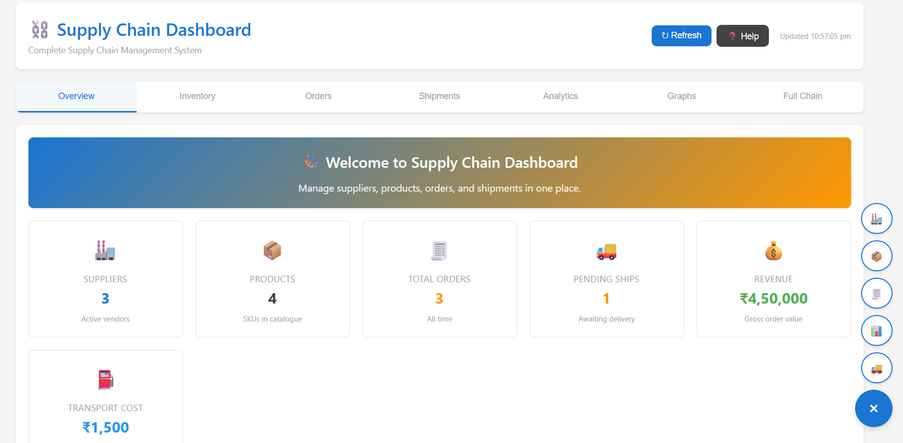
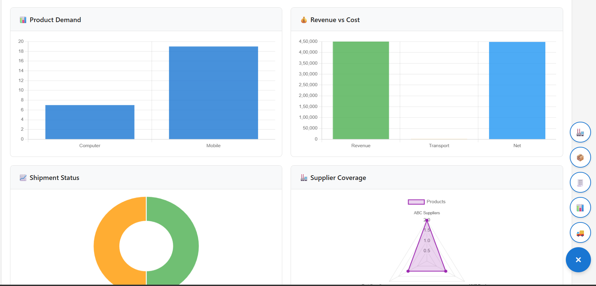
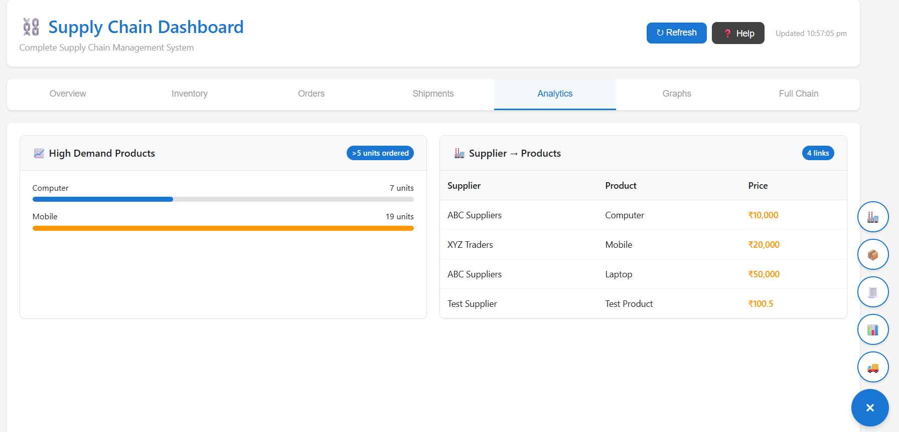

# 🏭 Supply Chain Management API

[](https://github.com/Yadavgaurav2/DBMS-SupplyChain-Dashboard)

A RESTful API built with **Node.js**, **Express**, and **MySQL** to manage and analyze supply chain data — including suppliers, products, inventory, orders, and shipments.

## � Repository

- GitHub: https://github.com/Yadavgaurav2/DBMS-SupplyChain-Dashboard
- Clone: `git clone https://github.com/Yadavgaurav2/DBMS-SupplyChain-Dashboard.git`

## 🚚 Supply Chain Overview

This project models a supply chain system that includes:

- Suppliers and vendors
- Product and inventory management
- Order processing and tracking
- Shipment coordination and delivery status
- Distributor relationships and analytics
## 📌 Project Status

- ✅ Repository created and pushed to GitHub
- ✅ Dashboard preview images added
- ✅ Backend API and frontend running locally
- 🚧 Next: add more analytics, improve UI, and deploy
## �📊 Dashboard Preview





---

## 🚀 Tech Stack

- **Runtime:** Node.js
- **Framework:** Express.js
- **Database:** MySQL (mysql2)
- **Other:** CORS, dotenv

---

## ⚙️ Setup & Installation

### 1. Clone the repository

```bash
git clone https://github.com/Yadavgaurav2/DBMS-SupplyChain-Dashboard.git
cd DBMS-SupplyChain-Dashboard
```

### 2. Install dependencies

```bash
npm install
```

### 3. Configure environment variables

Create a `.env` file in the root directory:

```env
DB_HOST=localhost
DB_USER=root
DB_PASSWORD=your_password
DB_NAME=SupplyChainDB
```

### 4. Set up the database

Make sure MySQL is running and a database named `SupplyChainDB` exists with the following tables:
- `Supplier`
- `Product`
- `Inventory`
- `Orders`
- `Shipment`
- `Distributor`

### 5. Start the server

```bash
node server.js
```

The API will be live at `http://localhost:5000`

---

## 📡 API Endpoints

### Core Data

| Method | Endpoint | Description |
|--------|----------|-------------|
| GET | `/api/suppliers` | Get all suppliers |
| GET | `/api/products` | Get all products |
| GET | `/api/inventory` | Get inventory with product names |
| GET | `/api/orders` | Get all orders with product & distributor info |
| GET | `/api/shipments` | Get all shipments |
| GET | `/api/shipments/pending` | Get pending deliveries only |

### 📊 Analytics

| Method | Endpoint | Description |
|--------|----------|-------------|
| GET | `/api/analytics/high-demand` | Products with total order quantity > 5 |
| GET | `/api/analytics/orders-per-product` | Order count & total quantity per product |
| GET | `/api/analytics/supplier-products` | Supplier–product mapping with prices |
| GET | `/api/analytics/full-chain` | Full supply chain view (stock → order → shipment) |

### 🧮 Dashboard

| Method | Endpoint | Description |
|--------|----------|-------------|
| GET | `/api/stats` | Summary stats: suppliers, products, orders, pending shipments, revenue, transport cost |

---

## 📦 Example Response — `/api/stats`

```json
{
  "suppliers": 5,
  "products": 12,
  "orders": 34,
  "pending": 8,
  "revenue": 124500.00,
  "transport": 3200.50
}
```

---

## 📁 Project Structure

```
supply-chain-api/
├── server.js       # Main server & all API routes
├── .env            # Environment variables (not committed)
├── package.json
└── README.md
```

---

## 🔒 Security Note

Never commit your `.env` file. Add it to `.gitignore`:

```
.env
node_modules/
```

---

## 🙌 Contributing

Pull requests are welcome! For major changes, please open an issue first.

---

## 📄 License

[MIT](LICENSE)
